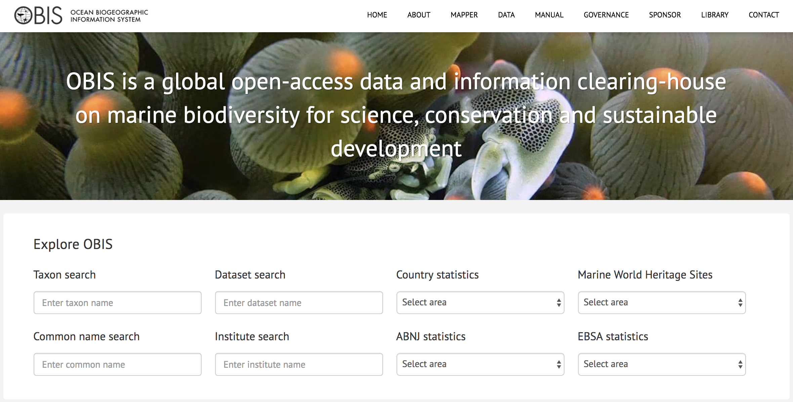
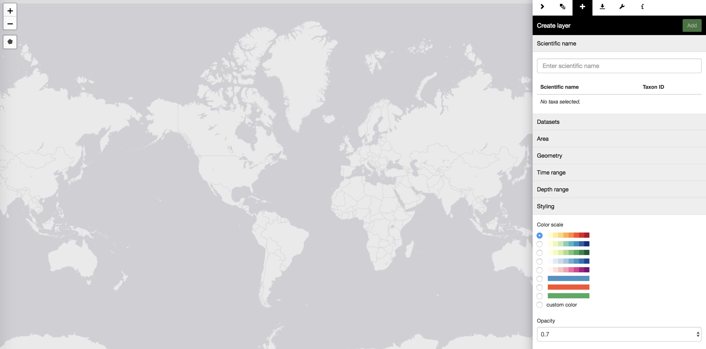

```{r setup, include=FALSE}
knitr::opts_chunk$set(echo = TRUE, warning = FALSE)
library(robis)
```

---

- In R
- In Python
- API
- Web

# In R

## Getting started

Installation

```{r installation, eval=FALSE}
# install.packages("devtools")
# devtools::install_github('iobis/robis')

install.packages("robis")

library(robis)
```

Help and issues

- Help: `help(package = "robis")`
- Manual: 
  - <http://iobis.org/manual/access/>
  - <http://iobis.org/manual/visualization/>
- Issues: <https://github.com/iobis/robis/issues>

## Additional libraries

```{r, message=FALSE}
library(ggplot2)
```

ggplot2: A very popular plotting system for R  
<http://ggplot2.org/>

```{r, message=FALSE}
library(leaflet)
```

Leaflet: R package for one of the most popular open-source JavaScript libraries for interactive maps.  
<https://rstudio.github.io/leaflet/>

## Occurrence

```{r, eval=FALSE}
occurrence(scientificname = NULL, year = NULL, obisid = NULL, aphiaid = NULL,
  groupid = NULL, resourceid = NULL, nodeid = NULL, areaid = NULL, startdate = NULL,
  enddate = NULL, startdepth = NULL, enddepth = NULL, geometry = NULL, qc = NULL,
  fields = NULL, verbose = FALSE)
```
```{r, cache=TRUE, message=FALSE}
ptevol <- occurrence("Pterois volitans") # red lionfish
colnames(ptevol)
```

## Filter by year

```{r, cache=TRUE}
occurrence("Pterois volitans", year = 1991, 
           fields = c("id", "decimalLongitude", "decimalLatitude", "year"))
```

## Filter by date

```{r, cache=TRUE}
occurrence("Pterois volitans", startdate = '1980-03-01', enddate = '1980-10-30', 
           fields = c("id", "decimalLongitude", "decimalLatitude", "eventDate"))
```

## Filter by depth

```{r, cache=TRUE}
occurrence("Pterois volitans", startdepth = 100, enddepth = 200,
           fields = c("id", "decimalLongitude", "decimalLatitude", "depth"))
```

## Filter by polygon

With <http://iobis.org/maptool>) we can create a WKT for the Perhentian and Redang Islands and use this to query all occurrences.

```{r, cache=TRUE}
islands <- occurrence(geometry = 
      paste("POLYGON ((102.68921 6.05862","102.57111 5.95346",
                      "103.07785 5.49980","103.25226 5.62555",
                      "103.07648 5.87970","102.68921 6.05862))",sep=", "))
```

## Filter by polygon

```{r leafletmapislands}
leafletmap(islands)
```

## Visualize data through time

```{r, message=FALSE, fig.height=4}
islands$year <- as.numeric(format(as.Date(islands$eventDate), "%Y"))
ggplot(islands[!is.na(islands$year),], aes(x = year, fill = phylum)) +
  geom_histogram(binwidth = 5) +
  scale_fill_brewer(palette = "Paired")
```

## Visualize multiple facets

```{r lagisfacets, cache=TRUE, results='hold'}
lag <- occurrence("Lagis", resourceid=c(4312, 222))
ggplot() +
 geom_histogram(data = lag, aes(x = yearcollected), binwidth = 2) +
 facet_grid(resourceID ~ species)
```

## Filter by dataset

```{r, cache=TRUE}
datasets <- dataset(q="Adriatic-INTERREG")
datasets$name
```

## Filter by dataset

```{r, cache=TRUE}
occ <- occurrence(resourceid = datasets$id, year = 1998,
           fields = c("id", "decimalLongitude", "decimalLatitude", "resourceID"))
head(occ)
```

## Filter by quality control

Vandepitte L., Bosch S., Tyberghein L., Waumans F., Vanhoorne B., Hernandez F., De Clerck O., & Mees J. (2015) **Fishing for data and sorting the catch: assessing the data quality, completeness and fitness for use of data in marine biogeographic databases**. Database, 2015. <http://dx.doi.org/10.1093/database/bau125>

```{r}
?qcflags
```

Categories of quality control flags:

- Data format
- Taxonomy
- Completeness
- Geography
- Depth
- Outliers

## Some filters: quality control

- 3\. Taxonomy: is the taxon level genus or lower?
- 4\. Geography (lat/lon): are the latitude/longitude values different from zero?
- 5\. Geography (lat/lon): are the latitude/longitude values within their possible boundaries? (world coordinates)
- 7\. Completeness (date/time): is the sampling year (start/end) completed and valid?

```{r, cache=TRUE}
qc3457 <- occurrence(resourceid = datasets$id, qc = c(3,4,5,7), year = 1998)
```

## Visualize QC

- 28\. Species outliers (geography): is the observation within three IQRs from the first & third quartile distance to the geographic centroid of this taxon?

```{r getacistu, cache=TRUE}
acistu <- occurrence("Acipenser sturio")

acistu$qcnum <- qcflags(acistu$qc, c(28))
colors <- c("#ee3300", "#86b300")[acistu$qcnum + 1]
popup <- paste0(acistu$datasetName, "<br/>", acistu$catalogNumber, 
                "<br/><a href=\"http://www.iobis.org/explore/#/dataset/", 
                acistu$resourceID, "\">OBIS dataset page</a>")
```

## Visualize QC

```{r acistuleafletqc, cache=TRUE, message = FALSE}
leaflet() %>% addProviderTiles("CartoDB.Positron") %>%
  addCircleMarkers(
    popup = popup, radius = 3.5, weight = 0, fillColor = colors, fillOpacity = 1,
    lat = acistu$decimalLatitude, lng = acistu$decimalLongitude)
```

## Visualize QC

```{r acistuggplotqc, cache=TRUE}
acistu$qctxt <- c("Not ok", "Ok")[acistu$qcnum + 1]
ggplot() +
  geom_polygon(data=map_data("world"),aes(x=long,y=lat,group=group),fill="#dddddd")+
  geom_point(data=acistu, aes(x=decimalLongitude, y=decimalLatitude, color=qctxt))
```

## Visualize environmental data

```{r acistuenvplot, cache=TRUE}
env <- obistools::lookup_xy(acistu)
envacistu <- cbind(acistu[complete.cases(env),], env[complete.cases(env),])
ggplot(envacistu, aes(x=sssalinity, y=sstemperature, color=qctxt)) +
  geom_point()
```

## _checklist_:  Generate checklists

```{r, eval=FALSE}
checklist(scientificname = NULL, year = NULL, obisid = NULL, aphiaid = NULL,
  groupid = NULL, resourceid = NULL, areaid = NULL, startdate = NULL, enddate = NULL,
  startdepth = NULL, enddepth = NULL, geometry = NULL, qc = NULL, fields = NULL,
  verbose = FALSE)
```

## _checklist_:  Generate checklists

```{r checklistexample, cache=TRUE}
checklist(year=1800)[1:3,]
```

## _dataset_: Dataset metadata

```{r, eval=FALSE}
dataset(id = NULL, scientificname = NULL, q = NULL, obisid = NULL, 
        aphiaid = NULL, groupid = NULL, areaid = NULL, nodeid = NULL, 
        startdate = NULL, enddate = NULL, startdepth = NULL, enddepth = NULL, 
        geometry = NULL, verbose = FALSE)
```

## _dataset_: Dataset metadata

```{r datasetexample, cache=TRUE}
as.data.frame(dataset(id = 1))
```

## _taxon_ and *taxon_common*

```{r, eval=FALSE}
taxon(obisid = NULL, aphiaid = NULL, scientificname = NULL, verbose = FALSE)
taxon_common(obisid, verbose = FALSE)
```

```{r taxonexample, cache=TRUE}
tax <- taxon(scientificname = "Pterois volitans")
tax
taxon_common(tax$valid_id)
```

## _area_: OBIS areas

```{r areas, cache=TRUE}
head(area())
```

## _node_: OBIS nodes

```{r nodes, cache=TRUE}
node()[1:5,]
```

## _group_: Taxonomic groups

```{r groups, cache=TRUE}
head(group())
```

# In Python

## Getting started

Installation

```{bash, eval=FALSE}
# from pypi
pip install pyobis

# dev
pip install git+git://github.com/sckott/pyobis.git#egg=pyobis
```

Help and issues: <https://github.com/sckott/pyobis>

## Occurrence

```{python, eval=FALSE}
from pyobis import occurrences
occurrences.search(scientificname = 'Mola mola')
occurrences.search(scientificname = 'Mola mola', offset=0, limit=10)
occurrences.search(geometry='POLYGON((30.1 10.1, 10 20, 20 40, 40 40, 30.1 10.1))', 
                   limit=20)
occurrences.search(aphiaid=key, year="2013", limit=20)
```

```{python, eval=FALSE}
res = occurrences.download(year = 2001, scientificname = 'Orcinus')
res.uuid
res.status()
res.fetch()
```

## Other methods

- checklist - Create a checklist for a geometry, timeperiod, taxonomic group, ...
- taxa - Lookup taxonomic names
- groups - List of taxonomic groups
- resources - Lookup datasets metadata
- nodes - Lookup OBIS nodes metadata

# API

## Documentation

REST API with same methods as implemented in *robis*.

<https://github.com/iobis/api-docs>

# Web

## Explore Portal

<http://iobis.org/>  

<center></center>

## Mapper

<http://iobis.org/mapper2>  

<center></center>
