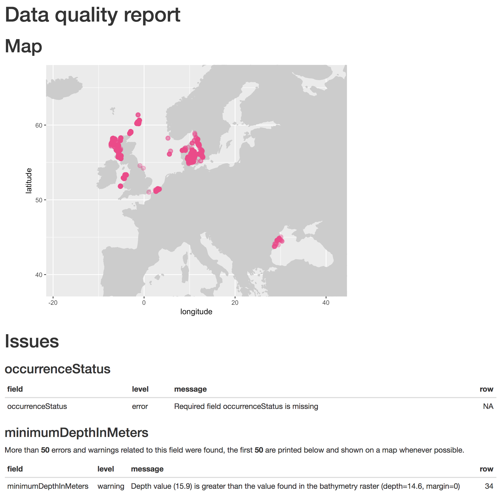
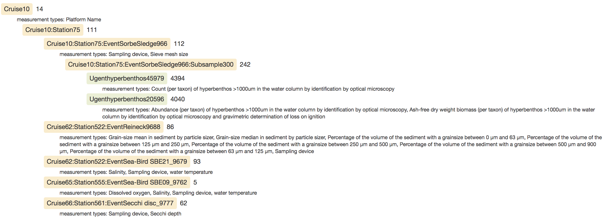

```{r setup, include=FALSE}
knitr::opts_chunk$set(echo = TRUE)
library(obistools)
```

## Getting started

Installation

```{r installation, eval=FALSE}
# install.packages("devtools")
devtools::install_github('iobis/obistools')

library(obistools)
```

Help and issues

- Manual: <http://www.iobis.org/manual/processing/>
- Issues: <https://github.com/iobis/obistools/issues>

## Generate a report

View points on a map and check missing fields, event dates, depth values, points on land, ...

```{r report, eval=FALSE}
report(abra, file="abra_report.html", dir=".")
```

[abra_report.html](abra_report.html)
  
<center></center>

## Check required fields

```{r check_fields}
check_fields(abra)
```

occurrenceStatus: A statement about the presence or absence of a Taxon at a Location.  
<http://rs.tdwg.org/dwc/terms/#occurrenceStatus>

## Map column names to Darwin Core terms

```{r map_fields}
data <- data.frame(
  id = c("cruise_1", "station_1", "station_2", "sample_1", "sample_2", "sample_3", "sample_4", "subsample_1", "subsample_2"),
  date = c(NA, NA, NA, "2017-01-01", "2017-01-02", "2017-01-03", "2017-01-04", NA, NA),
  locality = rep("North Sea", 9),
  lon = c(NA, 2.9, 4.7, NA, NA, NA, NA, NA, NA),
  lat = c(NA, 54.1, 55.8, NA, NA, NA, NA, NA, NA),
  stringsAsFactors = FALSE)

mapping <- list(
  decimalLongitude = "lon", decimalLatitude = "lat",
  datasetName = "dataset", eventID = "id", eventDate = "date")
```

[Issue 56: detect_fields](https://github.com/iobis/obistools/issues/56)

## Map column names to Darwin Core terms
```{r map_fields_result, eval=TRUE}
map_fields(data, mapping)
```

## Taxon matching

Interactive taxon matching with the World Register of Marine Species (WoRMS)

```{r, eval=FALSE}
taxa <- c("Abra alva", "Buccinum fusiforme", "Buccinum fusiforme", "hlqsdkf")
matched_taxa <- match_taxa(taxa)
matched_taxa
```
```
3 names, 1 without matches, 1 with multiple matches
Proceed to resolve names (y/n/p)? y

  AphiaID     scientificname      authority     status match_type
1  531014 Buccinum fusiforme   Kiener, 1834 unaccepted      exact
2  510389 Buccinum fusiforme Broderip, 1830 unaccepted      exact

Multiple matches, pick a number or leave empty to skip: 2
```
```{r, echo=FALSE}
matched_taxa <- data.frame(scientificName=c('Abra alba', rep('Buccinum fusiforme', 2), NA), scientificNameID=c('urn:lsid:marinespecies.org:taxname:141433', rep('urn:lsid:marinespecies.org:taxname:510389',2), NA), matche_type=c('near_1', rep('exact',2), NA))
matched_taxa
```

## Checking points on land

```{r, fig.height=3}
onland <- check_onland(abra)
onland[,1:5]
plot_map(onland, zoom = TRUE)
```

---

```{r, fig.height=6, fig.width=8}
robis::leafletmap(onland)
```


## Checking depth values

```{r}
depthreport <- check_depth(abra, report = TRUE)
depthreport[1:10, ]
```

## Checking depth values

```{r, fig.height=6, fig.width=8}
robis::leafletmap(abra[depthreport$row,])
```

## Checking depth values

Extra parameters for `check_depth`:

- `depthmargin`: How much can the given depth deviate from the bathymetry in the rasters (in meters).
- `shoremargin`: How far offshore (in meters) should a record be to have a bathymetry greater than 0. If NA (default) then this test is ignored.
- `bathymetry`: Raster* object that you want to use to check the depth against. If NULL (default) then the bathymetry from the xylookup service is used.

## Lookup XY

Data for on land and depth checks is provided by the xylookup service which can be called trough the `lookup_xy` function.

```{r, message=FALSE, warning=FALSE, cache=TRUE}
env <- lookup_xy(abra)
head(env)
```

## Check event date

```{r}
data_nodate <- data.frame(
  scientificName = c("Abra alba", "Lanice conchilega"),
  stringsAsFactors = FALSE)

check_eventdate(data_nodate)
```

## Check event date

```{r}
data_goodformats <- data.frame(
  eventDate = c(
    "2016",
    "2016-01",
    "2016-01-02",
    "2016-01-02 13:00",
    "2016-01-02T13:00",
    "2016-01-02 13:00:00/2016-01-02 14:00:00",
    "2016-01-02 13:00:00/14:00:00"), 
  stringsAsFactors = FALSE)

check_eventdate(data_goodformats)
```

## Check event date

```{r}
data_badformats <- data.frame(
  eventDate = c(
    "2016/01/02",
    "2016-01-02 13h00"),
  stringsAsFactors = FALSE)

check_eventdate(data_badformats)
```


## Dataset structure

```{r, eval=FALSE}
archive <- hyperbenthos$data
tree <- treeStructure(archive$event.txt, archive$occurrence.txt, 
                      archive$extendedmeasurementorfact.txt)
exportTree(tree, "hyperbenthos_tree.html")
```

[hyperbenthos_tree.html](hyperbenthos_tree.html)
  
<center></center>


## Check eventID and parentEventID

`check_eventids()` checks if both `eventID()` and `parentEventID` fields are present in an event table, and if al `parentEventID`s have a corresponding `eventID`.

```{r}
data <- data.frame(
  eventID = c("a", "b", "c", "d", "e", "f"),
  parentEventID = c("", "", "a", "a", "z", "b"),
  stringsAsFactors = FALSE
)
check_eventids(data)
```

## Check eventID in an extension

`check_extension_eventids()` checks if all `eventID`s in an extension have matching `eventID`s in the core table.

```{r}
event <- data.frame(
  eventID = c("cruise_1", "station_1", "station_2", 
              "sample_1", "sample_2", "sample_3", "sub_1", "sub_2"),
  parentEventID = c(NA, "cruise_1", "cruise_1", "station_1", "station_1", "station_2", 
                    "sample_3", "sample_3"),
  eventDate = c(NA, NA, NA, "2017-01-01", "2017-01-02", "2017-01-03", NA, NA),
  decimalLongitude = c(NA, 2.9, 4.7, NA, NA, NA, NA, NA),
  decimalLatitude = c(NA, 54.1, 55.8, NA, NA, NA, NA, NA),
  stringsAsFactors = FALSE)

event
```

## Check eventID in an extension

```{r}
occurrence <- data.frame(
  eventID = c("sample_1","sample_1","sample_28","sample_2","sample_3","sub_1"),
  scientificName = c("Abra alba", "Lanice conchilega", "Pectinaria koreni", 
                     "Nephtys hombergii", "Pectinaria koreni", "Abra alba"),
  stringsAsFactors = FALSE)

occurrence
```

## Check eventID in an extension

```{r}
check_extension_eventids(event, occurrence)
```

## Flatten event records

`flatten_event()` recursively adds event information from parent to child events.

```{r}
event
```
```{r}
flatten_event(event)
```

## Flatten occurrence and event records

`flatten_occurrence()` will add event information to occurrence records.

```{r}
occurrence
```

```{r}
occurrence[occurrence$eventID=="sample_28",] <- "sample_2"
flatten_occurrence(event, occurrence)
```

## Calculate centroid and radius for WKT geometries

WKT: text representation for geometries <https://en.wikipedia.org/wiki/Well-known_text>

    POINT (30 10)
    LINESTRING (30 10, 10 30, 40 40)
    POLYGON ((30 10, 40 40, 20 40, 10 20, 30 10))

`calculate_centroid()` calculates a centroid and radius for WKT strings. This is useful for populating `decimalLongitiude`, `decimalLatitude` and `coordinateUncertaintyInMeters`.

```{r}
wkt <- c(
  "POLYGON ((2.5378 51.1242, 2.9937 51.3203, 3.3453 51.3957, 2.2741 51.6998, 2.5378 51.1242))",
  "POLYGON ((3.1558 42.2356, 3.1324 42.1420, 3.2203 42.1124, 3.2601 42.2153, 3.1558 42.2356))"
)
centroid <- calculate_centroid(wkt)
centroid
```

## Centroid and radius for WKT
```{r}
if(!requireNamespace("sf")){
  install.packages(sf)
}
features <- sf::st_as_sfc(wkt)
map <- robis::leafletmap(centroid)
leaflet::addPolygons(map, data = features)
```
